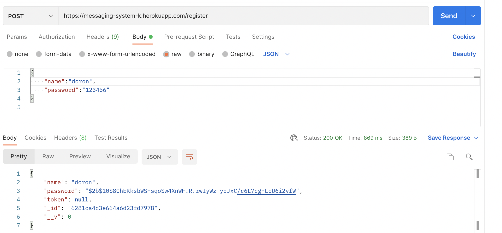

# Messaging System

## System purpose
An API CRUD system for users and massage management.  
Users can register and login to the system and also  
read,send and delete messages.  

## features

### 1)Registration
In order to register to the system we need to enter  
the following url by POST method:  
https://messaging-system-k.herokuapp.com/registere  
along with "name" and "password" parameters.
.

### 2)Login
In order to login the system  we need to enter  
the following url by POST method:  
https://messaging-system-k.herokuapp.com/login  
along with "name" and "password" parameters.
.
after the login the user will receive a session token.  

### 3)Get all users
in order to get all users we need to enter  
the following url by GET method:  
https://messaging-system-k.herokuapp.com/users  

### 4)Create message
in order to create a new message we need to enter  
the following url by POST method:  
https://messaging-system-k.herokuapp.com/messages/{name}   
along with "receiver", "subject" and "text" parameters.    
also,Token is needed in the request header(key=x-access-token,value={Token})  
.
.

### 5)Get all messages
in order to get all messages we need to enter  
the following url by GET method:  
https://messaging-system-k.herokuapp.com/messages/{name}  
also,Token is needed in the request header(key=x-access-token,value={Token})

### 6)Read a message
in order to read a message we need to enter  
the following url by PUT method:  
https://messaging-system-k.herokuapp.com/messages/{name}/{id} 
also,Token is needed in the request header(key=x-access-token,value={Token})  

### 7)Get all unread messages
in order to get all unread messages we need to enter  
the following url by GET method:  
https://messaging-system-k.herokuapp.com/messages/{name}/unread  
also,Token is needed in the request header(key=x-access-token,value={Token})  
  
  

### 8)Delete a message
in order to delete a message we need to enter  
the following url by DELETE method:  
https://messaging-system-k.herokuapp.com/messages/{name}/{id} 
also,Token is needed in the request header(key=x-access-token,value={Token})  

